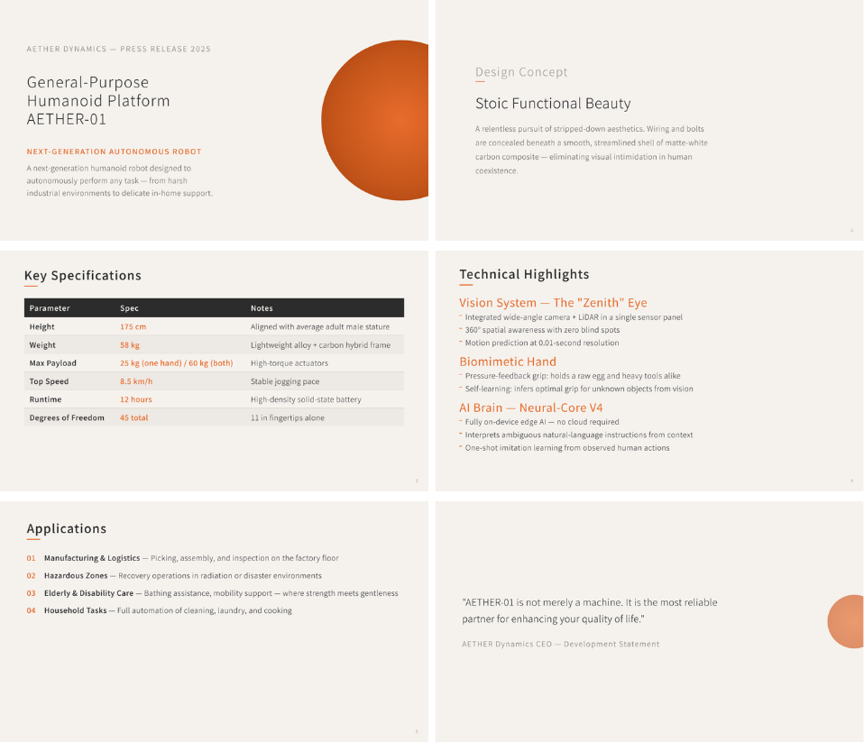
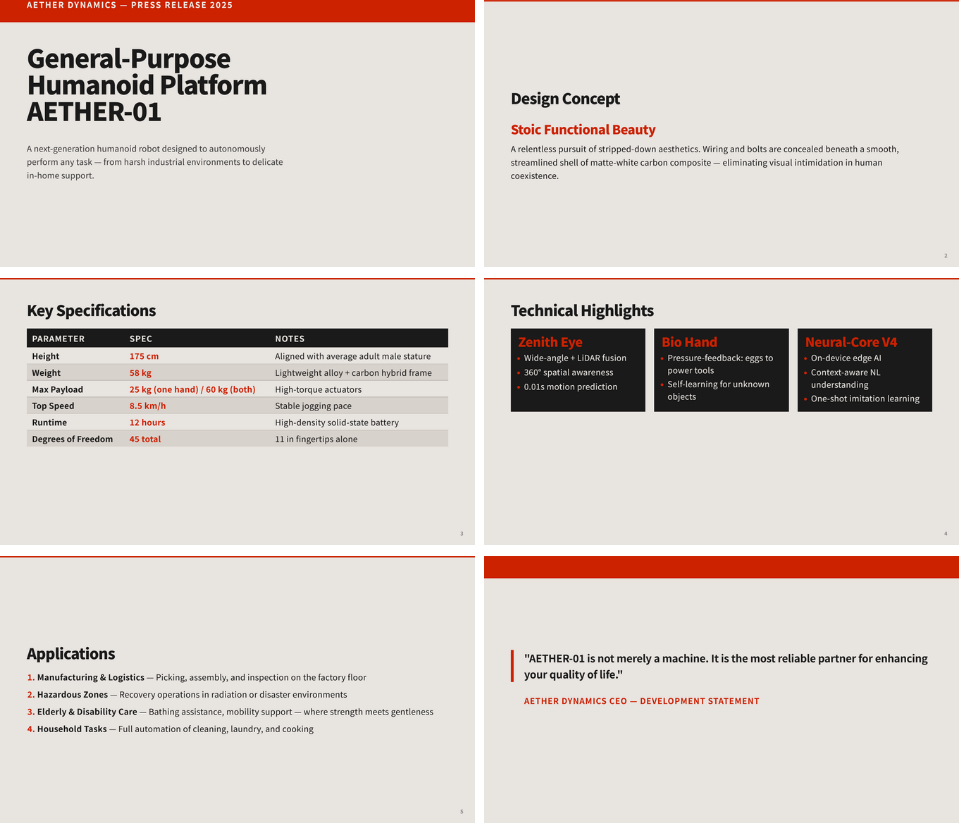

<h1 align="center">basicslide</h1>

<p align="center">
  <em>A Claude Code plugin that generates Marp presentations<br>with bespoke visual design — not assembled from templates.</em>
</p>

<p align="center">
  <a href="LICENSE">
    
  </a>
  
  
</p>

<p align="center">
  <a href="#how-it-works">How It Works</a> &bull;
  <a href="#quick-start">Quick Start</a> &bull;
  <a href="#sample-output">Sample Output</a> &bull;
  <a href="#plugin-structure">Plugin Structure</a> &bull;
  <a href="#license">License</a>
</p>

---

Every presentation gets a **unique visual identity** designed from scratch through interactive design thinking. You describe the purpose and audience; the plugin handles tone selection, color palettes, typography, layout, and a multi-axis quality evaluation — then iterates until the design holds up.

## Sample Output

**Braun Design Manual** — warm paper, signal orange circle, light typography

<p align="center">
  
</p>

**Concrete Brutalism Poster** — raw concrete, red structural beam, stamped type

<p align="center">
  
</p>

Both generated from the same input content with different design directions.

## How It Works

```
User: "Create slides for a robot product launch"
         │
         ▼
┌─────────────────────┐
│  slide-gen (skill)  │  ← Interactive design thinking
│  Phase 1: Tone,     │     Tone × Metaphor × UNFORGETTABLE
│  Color, Typography  │
└────────┬────────────┘
         │ Design brief
         ▼
┌─────────────────────┐
│  slide-gen-worker   │  ← Generates Marp file + screenshots
│  (SubAgent)         │     Reads design-guideline at runtime
└────────┬────────────┘
         │ Screenshots
         ▼
┌─────────────────────┐
│  slide-evaluator    │  ← 4-axis scoring (Cohesion, Purpose,
│  (SubAgent)         │     Craft, Narrative) + fix suggestions
└────────┬────────────┘
         │ Score ≥ 3/5 on all axes?
         ▼
    Pass → Done
    Fail → Re-generate with feedback (max 3 cycles)
```

### Design Philosophy

> The real risk is not a design that's too bold — it's a design that's too bland.

The plugin interprets your direction at its most extreme, then refines. Giant typography, dramatic color, radical whitespace. The evaluator and you will dial back excess; no one can inject boldness into boredom.

## Quick Start

### 1. Install the plugin

```
/plugin marketplace add https://github.com/khaym/basicslide.git
/plugin install basicslide@basicslide
```

### 2. Generate slides

```
/slide-gen
```

Provide your content as Markdown — either in a file or directly in the conversation. The plugin will ask about your audience and tone, then generate a complete presentation.

**Content modes:**

| Mode | Behavior | Best for |
|------|----------|----------|
| `default` | Adjusts and restructures text to fit the slide layout | Marketing, product launches, creative content |
| `verbatim` | Places all text exactly as written — no rewording, no shortening | Financial reports, compliance docs, quoted material |

The plugin will:
- Ask which content mode you prefer
- Auto-setup the project (theme, scripts, Marp CLI) on first run
- Generate a complete Marp presentation with bespoke visual design
- Evaluate and refine until quality passes

### 3. Build to PNG

```bash
npm run build:one -- slides/my-presentation.md
```

## Plugin Structure

```
plugins/basicslide/
├── skills/
│   ├── slide-gen/          # Orchestrator: design thinking + refinement loop
│   │   ├── themes/         # Bundled Marp theme (auto-copied to project)
│   │   └── scripts/        # Build + font-size check scripts
│   └── design-guideline/   # Design principles, visual rules, patterns
└── agents/
    ├── slide-gen-worker/   # Generates Marp files (model: sonnet)
    └── slide-evaluator/    # 4-axis quality scoring (model: sonnet)
```

### Skills

| Skill | Trigger | Description |
|-------|---------|-------------|
| `slide-gen` | "create slides", "make a presentation" | Full orchestration: design thinking → generation → evaluation → refinement |
| `design-guideline` | "design guideline", "design rules" | Design principles reference (Nielsen's heuristics adapted for slides) |

### Evaluation Axes

| Axis | What it measures |
|------|-----------------|
| **Cohesion & Rhythm** | Palette consistency, intensity curve across slides |
| **Purpose Alignment** | Does the design serve the presentation's goal? |
| **Craft** | Typography, spacing, contrast, accessibility |
| **Narrative Flow** | Does the slide sequence tell a coherent story? |

Minimum passing: **3/5 on all axes**.

## Requirements

- [Claude Code](https://claude.ai/code) CLI or IDE extension
- Node.js (for Marp CLI)
- Chromium (for PNG/PDF export)

The plugin auto-installs Marp CLI and checks for Chromium/CJK fonts on first run.

## License

[MIT](LICENSE)
